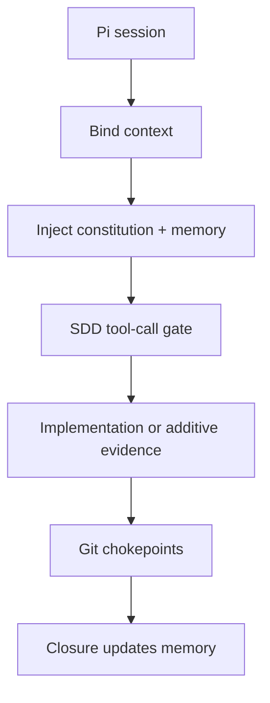

## Visão atômica

`dadaia-pi-workspace` turns Pi Coding Agent into an SDD-native multi-project
workspace. It keeps the strongest ideas from `dadaia-workspace`: Spec Context
Projects, current-product memory, release gates, additive evidence, mutating
leases, and context injection. It discards multi-harness projection and designs
directly for Pi's extension, skill, prompt, package, and session model. It also
documents Pi trust honestly: resource loading approval is not sandboxing.

## Usuários

| User | Need |
|---|---|
| Operator | Manage multiple software repos with clear specs, memory, and lifecycle state |
| Pi session | Receive the right context and rules for the active Spec Context Project |
| Product steward | Define releases, update memory, and close work without losing product truth |
| Implementer | Work inside approved tasks without colliding with other mutating sessions |
| Reviewer | Produce additive evidence and block unsafe transitions at review boundaries |

## Catálogo de features

| Slug | Title | TL;DR |
|---|---|---|
| `product-vision` | Product Vision | Pi-only SDD workspace identity and non-goals |
| `spec-context-projects` | Spec Context Projects | One canonical specs tree bound to one repo |
| `pi-native-agent-surface` | Pi-Native Agent Surface | Extensions, skills, prompts, packages, and AGENTS.md |
| `sdd-lifecycle-governance` | SDD Lifecycle Governance | Release phases, memory, additive evidence, mutating leases |
| `pi-trust-and-security` | Pi Trust and Security | Trust controls resource loading, not sandboxing |
| `pi-native-status-surface` | Pi-Native Status Surface | `dadaia-pi status` plus loopback browser panel at http://127.0.0.1:4999/ |

## Mapa de capacidades

## Limites conhecidos

- Initial specs define product direction; implementation has not started.
- Pi project-local resources require trust before they load.
- Non-interactive Pi flows do not prompt for trust; use `--approve` only for repositories already reviewed and intentionally trusted.
- Pi is not a sandbox; package resources and project-local `.pi/**` must be treated as executable code, and isolation must be provided by the OS, container, VM, or operator workflow.
- The old `dadaia-workspace` panel is a source of capability ideas, not an implementation to copy; Pi-native visibility starts with CLI/doctor/status surfaces.
